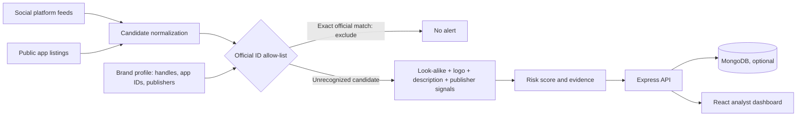

# SignalGuard

A MERN-style digital risk protection prototype focused on social profile and mobile app impersonation. The React/Vite dashboard uses an Express API, Gemini Google Search grounding for on-demand public-web discovery, and MongoDB persistence when `MONGODB_URI` is configured. Without a Gemini key or database, the seeded demo remains available in memory.

## Run locally

Requires Node.js 20.19+ or 22.12+.

```powershell
npm install
Copy-Item .env.example .env
# Add your Gemini API key to .env
npm run dev
```

Create a key in [Google AI Studio](https://aistudio.google.com/apikey) and add it as `GEMINI_API_KEY` in `.env`; `GEMINI_MODEL` defaults to `gemini-3.8-flash`. Keep this server-side key private. Open the Vite URL printed in the terminal (normally `http://localhost:5173`). The API listens on port 4000. To enable persistence, set `MONGODB_URI` in `.env` as well.

## Prototype scope

- Edit a brand identity, official social handles, and official app IDs/publishers.
- Review social and app-store findings, filter by status, and update triage state.
- With `GEMINI_API_KEY`, run an on-demand Gemini scan using Google Search grounding to discover currently indexed public pages; each finding links to its grounded source. Without a key, scans use sample fixtures.
- The scan pipeline excludes exact official handles/app IDs before scoring candidates. Name similarity, logo, description, and publisher signals contribute to an explainable risk score.
- Search grounding is not a continuous feed and cannot access private or unindexed content. Dedicated social/app-store connectors require authorized platform APIs. Google Search grounding may incur API usage charges.

## Architecture



Production social and app store connectors are outside this prototype; the architecture view calls this out in the UI.